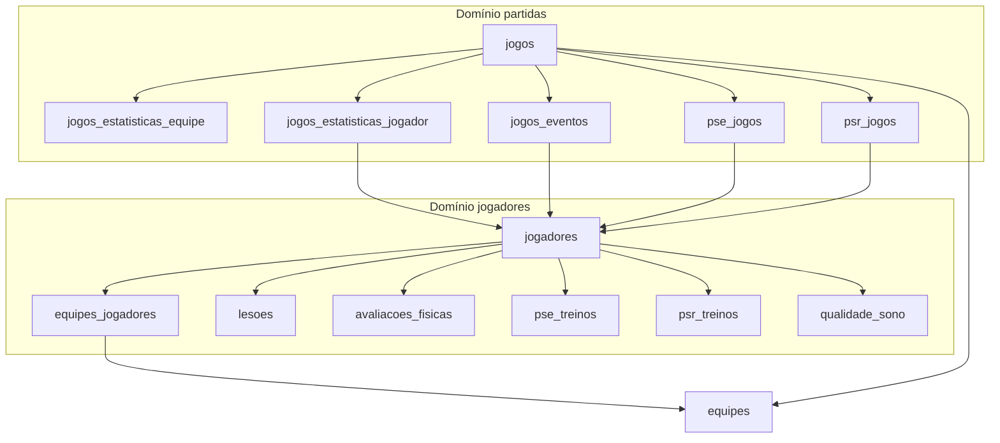

# Aplicação ↔ Banco de dados (SCOUT 21 PRO)

Este documento descreve **de onde os dados vêm na aplicação** (API REST do backend) e **em quais tabelas PostgreSQL** eles são persistidos, separando o que é **domínio de jogadores** e o que é **domínio de partidas**. O front-end (`21Scoutpro`) consome o backend via `VITE_API_URL` / `http://localhost:3000/api` (ver `21Scoutpro/config.ts`).

**Stack:** Express + Prisma (`backend/prisma/schema.prisma`). Os nomes em **negrito** são tabelas reais no Postgres (`@@map` do Prisma).

**Multi-tenant:** a maior parte dos dados é filtrada pelo **tenant** do usuário autenticado (`tenantMiddleware`): tipicamente `equipe_ids` do técnico/clube. Registros sem vínculo com essas equipes não são expostos.

---

## Rotas da API (referência rápida)

| Prefixo | Uso principal |
|--------|----------------|
| `/api/auth` | Login, perfil, usuários (admin) → `users`, `roles`, `tecnicos` |
| `/api/teams` | Equipes → `equipes` |
| `/api/players` | Jogadores + vínculo elenco → `jogadores`, `equipes_jogadores` |
| `/api/matches` | Partidas e estatísticas scout → `jogos`, `jogos_estatisticas_*` |
| `/api/schedules` | Programação → `programacoes`, `programacoes_dias` |
| `/api/assessments` | Avaliação física → `avaliacoes_fisicas` |
| `/api/stat-targets` | Metas por equipe → `metas_estatisticas` |
| `/api/championship-matches` | Jogos dentro de campeonatos → `campeonatos_jogos` |
| `/api/time-controls` | Entrada/saída em jogo → `jogos_eventos` |
| `/api/wellness` | Bem-estar (PSE/PSR/sono) → tabelas listadas na seção mista |
| `/api/championships` | Campeonatos → `campeonatos` |
| `/api/competitions` | Cadastro de competições (global) → `competicoes` |

---

## Domínio: jogadores

Dados cuja **entidade principal** é o atleta (`jogadores.id`).

### Tabela `jogadores`

- **Origem na app:** CRUD via `GET/POST/PUT/DELETE /api/players`.
- **Conteúdo:** cadastro do atleta (nome, apelido, data de nascimento, posição, camisa, medidas, foto, `max_loads_json`, status de transferência/atividade, etc.).
- **Observação:** o elenco visível no tenant vem de jogadores com vínculo ativo em `equipes_jogadores` (`data_fim` nulo).

### Tabela `equipes_jogadores`

- **Origem na app:** criada/atualizada no fluxo de **criação/edição de jogador** no `playersService` (vincula `jogador_id` a `equipe_id` com `data_inicio` / `data_fim`).
- **Função:** relaciona jogador à equipe do tenant (histórico de passagem pelo elenco).

### Tabela `lesoes`

- **Origem na app:** agregadas nas respostas de `/api/players` (serviço junta `lesoes` por `jogador_id`).
- **Persistência:** repositório `lesoes` (criação/atualização conforme endpoints de jogador / payloads do front).
- **Conteúdo:** lesões por jogador (datas, tipo, local, severidade, etc.).

### Tabela `avaliacoes_fisicas`

- **Origem na app:** `GET/POST/PUT/DELETE /api/assessments` e também embutidas no objeto do jogador em `/api/players`.
- **Chave:** `jogador_id` + `data` (único por jogador/data).

### Tabelas de bem-estar **por data e equipe** (ligadas ao jogador, não à partida)

| Tabela | API wellness | Chaves |
|--------|----------------|--------|
| `pse_treinos` | `GET/POST .../api/wellness/pse-treino` | `equipe_id`, `jogador_id`, `data` |
| `psr_treinos` | `GET/POST .../api/wellness/psr-treino` | `equipe_id`, `jogador_id`, `data` |
| `qualidade_sono` | `GET/POST .../api/wellness/qualidade-sono` | `equipe_id`, `jogador_id`, `data` |

Valores e observações são salvos em bulk (`POST /api/wellness/:type/bulk`).

---

## Domínio: partidas

Dados cuja **entidade principal** é o jogo (`jogos.id`).

### Tabela `jogos`

- **Origem na app:** `GET/POST/PUT/DELETE /api/matches`.
- **Conteúdo:** adversário, data, campeonato (texto), `competicao_id`, local, placar, vídeo, `status`, fase de coleta (`collection_phase`), JSONs de pós-jogo (`post_match_event_log`, `player_relationships`, `lineup`, `substitution_history`), etc.
- **Chave estrangeira:** `equipe_id` → `equipes`.

### Tabela `competicoes`

- **Origem na app:** `/api/competitions` (lista/criação; sem filtro de tenant no `app.ts`).
- **Uso:** `jogos.competicao_id` referencia competição quando preenchido.

### Tabela `jogos_estatisticas_equipe`

- **Origem na app:** persistida pelo fluxo de **matches** (uma linha por `jogo_id`, única por partida).
- **Conteúdo:** totais da equipe na partida (gols, passes, desarmes, cartões, métodos de gol, etc.).

### Tabela `jogos_estatisticas_jogador`

- **Origem na app:** fluxo de scout / partida (`matches` service/repository).
- **Conteúdo:** estatísticas por **jogador nesta partida**; chave lógica `jogo_id` + `jogador_id`.

### Tabela `jogos_eventos`

- **Origem na app:** `/api/time-controls` (entrada/saída, minuto/segundo).
- **Conteúdo:** eventos de tempo de jogo por `jogo_id` e `jogador_id` (`tipo_evento`).

### Tabelas de bem-estar **por jogo** (ligadas à partida)

| Tabela | API wellness | Chaves |
|--------|----------------|--------|
| `pse_jogos` | `GET/POST .../api/wellness/pse-jogo` | `jogo_id`, `jogador_id` |
| `psr_jogos` | `GET/POST .../api/wellness/psr-jogo` | `jogo_id`, `jogador_id` |

Para tipos com `jogo_id`, o backend filtra pelo `equipe_id` do jogo para garantir o tenant.

### Campeonatos e calendário

| Tabela | Origem na app |
|--------|----------------|
| `campeonatos` | `/api/championships` |
| `campeonatos_jogos` | `/api/championship-matches` (linhas de calendário; opcional `jogo_id` ligando a um registro em `jogos`) |

---

## Domínio: equipe e agenda (contexto compartilhado)

Não são “só jogador” nem “só partida”, mas sustentam os dois.

| Tabela | API | Notas |
|--------|-----|--------|
| `equipes` | `/api/teams` | Time do tenant (`tecnico_id` / `clube_id`). |
| `programacoes` | `/api/schedules` | Macrociclo por equipe. |
| `programacoes_dias` | via schedules | Dias da programação. |
| `metas_estatisticas` | `/api/stat-targets` | Metas numéricas por equipe. |

---

## Autenticação e usuários (fora de jogadores/partidas)

| Tabela | Uso |
|--------|-----|
| `users` | Conta de acesso, `role_id`, preferências de exibição de time. |
| `roles` | Papéis (ex.: administrador). |
| `tecnicos` | Perfil técnico ligado a `users`; dono das `equipes` quando aplicável. |
| `clubes` | Perfil de clube ligado a `users` (quando usado). |

---

## Resumo visual

---

## Manutenção

- **Schema canônico:** `backend/prisma/schema.prisma`.
- **Mapeamento código ↔ tabelas:** repositórios em `backend/src/repositories/*.ts` e serviços em `backend/src/services/*.ts`.

Se novas telas forem adicionadas no front, o caminho típico é: componente → `fetch` para `/api/...` → controller → service → repository → tabela acima.
